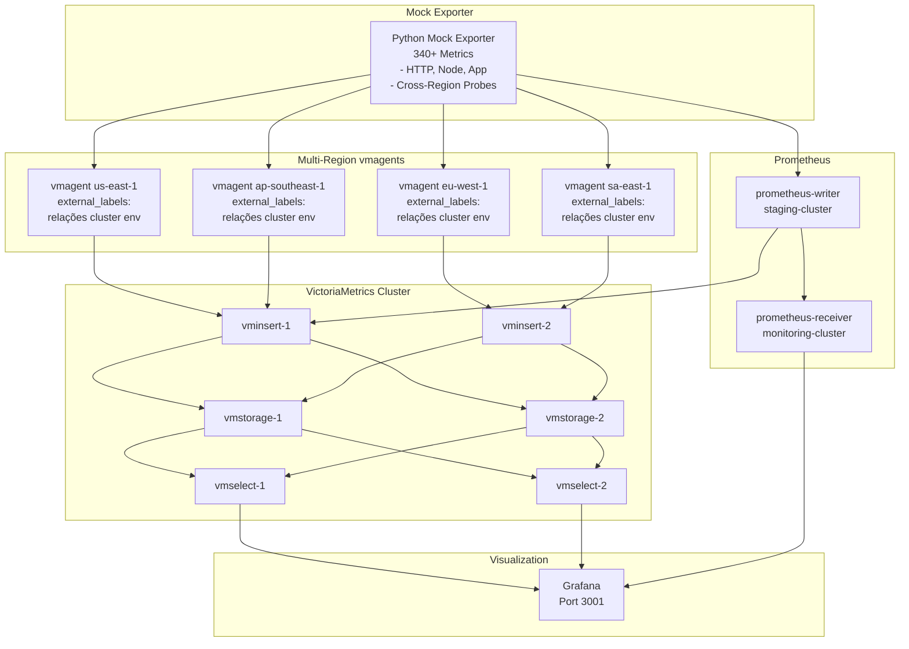

# Prometheus Remote Write Demo with VictoriaMetrics

A production-ready observability architecture demonstrating Prometheus remote write, VictoriaMetrics cluster deployment, and multi-region monitoring simulation.

## Architecture



## Features

- **340+ Production Metrics**: HTTP (RED), node/system (USE), application business metrics, and cross-region probes
- **VictoriaMetrics Cluster**: Distributed time series database with 2x vminsert, 2x vmselect, 2x vmstorage nodes
- **Multi-Region Simulation**: 4 vmagent instances simulating different AWS regions with region-specific labels
- **Dual Observability Stack**: Compare Prometheus native and VictoriaMetrics architectures side-by-side
- **Cross-Region Latency Monitoring**: Synthetic probes tracking connectivity and latency between regions
- **Ready-to-Use Dashboards**: Pre-configured Grafana dashboards for infrastructure, application, and multi-region monitoring

## Quick Start

```bash
# Clone repository
git clone <repo>
cd prom-remote-writer

# Start all services
docker compose up -d

# Check service status
docker compose ps

# Access Grafana
open http://localhost:3001
# Default credentials: admin/admin
```

## Prerequisites

- Docker Desktop (or Docker Engine + Docker Compose)
- 8GB+ available RAM
- Ports available: 3001, 9091, 9092, 8427, 2112, 8480, 8481, 8482

## Architecture Overview

This project demonstrates two observability architectures:

### 1. Prometheus Native Flow
```
Mock Exporter → Prometheus Writer → Prometheus Receiver → Grafana
```

### 2. VictoriaMetrics Multi-Region Flow
```
Mock Exporter → vmagents (4 regions) → vminsert cluster → vmstorage → vmselect → Grafana
```

Each vmagent instance adds region-specific labels (`region`, `cluster`, `environment`) via external_labels, enabling multi-dimensional analysis across regions.

## Demo Scenarios

### Scenario 1: Prometheus Remote Write
Compare Prometheus-to-Prometheus remote write with bidirectional communication.

### Scenario 2: VictoriaMetrics Multi-Region
Simulate a multi-region deployment with 4 vmagent instances scraping the same source but adding different labels, demonstrating how remote write aggregation works in production.

### Scenario 3: Cross-Region Latency Monitoring
Synthetic probes monitor latency between regions (us-east-1, eu-west-1, ap-southeast-1, sa-east-1) using realistic latency values based on geographical distance.

### Scenario 4: Query Comparison
Compare PromQL query performance and results between:
- Prometheus Receiver: `http://localhost:9091`
- VictoriaMetrics: `http://localhost:8427/select/0/prometheus`

## Key Components

| Component | Description | Port |
|-----------|-------------|------|
| **Mock Exporter (Python)** | Generates 340+ Prometheus-compliant metrics | 2112 |
| **VictoriaMetrics Cluster** | 2x vminsert, 2x vmselect, 2x vmstorage | 8480-8482 |
| **vmagent** | 4 instances simulating us-east-1, eu-west-1, ap-southeast-1, sa-east-1 | - |
| **Prometheus Writer** | Scrapes and remote writes to both VM and Prometheus | 9092 |
| **Prometheus Receiver** | Receives remote write from Prometheus Writer | 9091 |
| **Grafana** | Pre-configured dashboards | 3001 |

## Metrics Overview

### HTTP Service Metrics (RED Method)
- `http_request_duration_seconds` (histogram)
- `http_requests_total` (counter)
- `http_request_size_bytes` (histogram)
- `http_response_size_bytes` (histogram)

### Node/System Metrics (USE Method)
- `node_cpu_seconds_total` (counter)
- `node_memory_MemTotal_bytes` (gauge)
- `node_memory_MemAvailable_bytes` (gauge)
- `node_disk_io_time_seconds_total` (counter)
- `node_network_transmit_bytes_total` (counter)
- `node_network_receive_bytes_total` (counter)
- `node_filesystem_size_bytes` (gauge)
- `node_filesystem__bytes` (gauge)

### Application Business Metrics
- `app_errors_total` (counter)
- `app_database_queries_duration_seconds` (histogram)
- `app_database_connections_active` (gauge)
- `app_cache_requests_total` (counter)
- `app_queue_size` (gauge)
- `app_worker_tasks_duration_seconds` (histogram)
- `app_business_transactions_total` (counter)

### Cross-Region Probe Metrics
- `probe_http_duration_seconds` (histogram) - Tracks latency between regions
- `probe_success_total` (counter) - Monitors connectivity health

For detailed metrics documentation, see [docs/metrics/reference.md](docs/metrics/reference.md).

## Configuration Best Practices

The vmagent configuration uses `external_labels` to ensure consistent labeling across all metrics:

```yaml
# vmagent/us-east-1.yml
global:
  scrape_interval: 15s
  external_labels:
    region: "us-east-1"
    cluster: "prod-us"
    environment: "production"

scrape_configs:
  - job_name: "mock-exporter-us-east-1"
    static_configs:
      - targets: ["mock-exporter-python:2112"]
    relabel_configs:
      - target_label: job
        replacement: "mock-exporter"
      - target_label: availability_zone
        replacement: "us-east-1a"
```

**Benefits of external_labels:**
- Single source of truth in configuration files
- Automatically applied to all scraped metrics
- Easier to maintain and version control
- Follows VictoriaMetrics best practices
- Eliminates duplicate labels between config and command-line flags

## Documentation

- [Documentation Index](docs/README.md) - Complete documentation overview
- [Architecture Guide](docs/architecture/overview.md) - Detailed architecture documentation
- [Metrics Reference](docs/metrics/reference.md) - Comprehensive metrics documentation
- [Quick Start Guide](docs/guides/quick-start.md) - Step-by-step setup instructions
- [Configuration Guide](docs/guides/configuration.md) - Configuration reference
- [Troubleshooting Guide](docs/guides/troubleshooting.md) - Common issues and solutions
- [Best Practices](docs/guides/best-practices.md) - VictoriaMetrics best practices
- [Query Examples](docs/examples/queries.md) - Common PromQL queries

For Vietnamese documentation, see [README.vi.md](README.vi.md).

## Contributing

This is a demonstration project showcasing production-ready observability patterns. Contributions and feedback are welcome!

## License

MIT License
