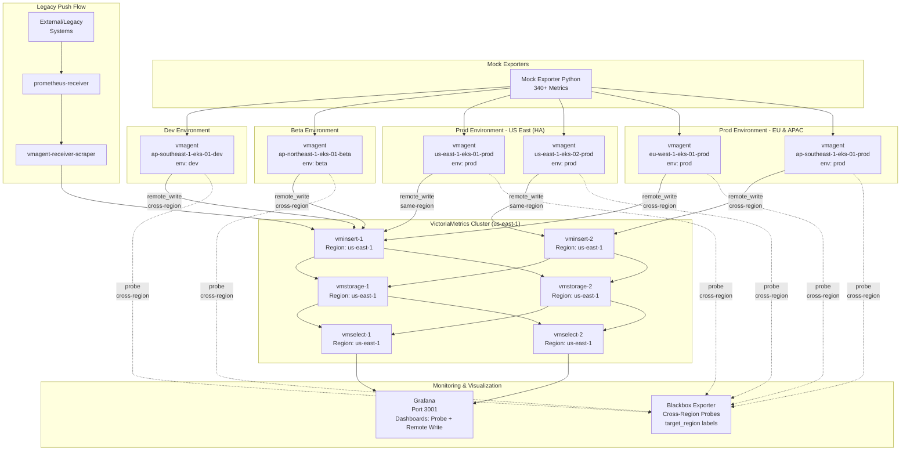

# Multi-Environment Multi-Cluster Monitoring with VictoriaMetrics

A production-ready observability architecture demonstrating multi-environment (dev/beta/prod), multi-cluster monitoring across regions with VictoriaMetrics, vmagent, and comprehensive latency monitoring.

## Architecture



## Features

- **Multi-Environment Setup**: Separate dev, beta, and prod environments with dedicated clusters
- **Multi-Cluster HA**: 2 production clusters in US East for high availability
- **Multi-Region Monitoring**: 4 AWS regions (us-east-1, eu-west-1, ap-southeast-1, ap-northeast-1)
- **VictoriaMetrics Cluster**: Distributed TSDB with 2x vminsert, 2x vmselect, 2x vmstorage
- **6 vmagent Instances**: Each cluster has dedicated vmagent with env/region/cluster labels
- **Legacy System Support**: Prometheus receiver for remote write from external systems
- **Cross-Region Latency Monitoring**: Blackbox exporter for network latency probes
- **Production-Ready Dashboards**: 4 focused dashboards (infrastructure, application, monitoring health, cross-region latency)

## Quick Start

```bash
# Clone repository
git clone <repo>
cd prom-remote-writer

# Start all services
docker compose up -d

# Check service status
docker compose ps

# Access Grafana
open http://localhost:3001
# Default credentials: admin/admin
```

## Prerequisites

- Docker Desktop (or Docker Engine + Docker Compose)
- 8GB+ available RAM
- Ports available: 3001, 9091, 9115, 2112, 8429-8434

## Architecture Overview

This project demonstrates a production-ready multi-environment, multi-cluster monitoring setup with two distinct data flows:

### Flow 1: Scraping (Main Flow) - Modern vmagent Infrastructure
```
Application/Mock Exporter → vmagent (same cluster) → vminsert → vmstorage → vmselect
```

**6 vmagent Clusters**:
- **Dev Environment**: `ap-southeast-1-eks-01-dev`
- **Beta Environment**: `ap-northeast-1-eks-01-beta`
- **Prod Environment**:
  - `us-east-1-eks-01-prod` (HA cluster 1)
  - `us-east-1-eks-02-prod` (HA cluster 2)
  - `eu-west-1-eks-01-prod`
  - `ap-southeast-1-eks-01-prod`

**Key Features**:
- Each vmagent scrapes applications in its cluster
- Self-scraping for internal metrics (`scrape_duration_seconds`)
- Blackbox exporter probes for cross-region latency
- `external_labels`: env, region, cluster, availability_zone
- Direct remote write to vminsert (no intermediary)

### Flow 2: Pushing (Legacy Systems Support)
```
External/Legacy System → prometheus-receiver → vmagent-receiver-scraper → vminsert
```

**Purpose**: Accept remote write from external Prometheus instances or legacy systems

**Components**:
- `prometheus-receiver`: Remote write endpoint (port 9091)
- `vmagent-receiver-scraper`: Scrapes receiver metrics, forwards to VictoriaMetrics
- Labels: `env=prod`, `region=us-east-1`, `cluster=us-east-1-eks-01-prod-legacy` (legacy system)

### Flow 3: Query
```
Grafana → vmselect → vmstorage
```

**Data Organization**: All metrics stored in single VictoriaMetrics cluster, separated by labels:
- `env`: dev, prod, monitoring
- `region`: us-east-1, eu-west-1, ap-southeast-1, local
- `cluster`: {region}-{env}-{type}-{number}

## Use Cases

### Multi-Environment Monitoring
Monitor separate dev and prod environments with isolated metrics:
```promql
# Dev environment metrics
sum(rate(http_requests_total{env="dev"}[5m]))

# Prod environment metrics by region
sum(rate(http_requests_total{env="prod"}[5m])) by (region)
```

### High Availability Monitoring
US East has 2 clusters for HA. Monitor both clusters independently:
```promql
# Compare request rate across HA clusters
sum(rate(http_requests_total{cluster=~"us-east-1-prod-eks-.*"}[5m])) by (cluster)
```

### Cross-Region Latency Analysis
**Blackbox Probes** (synthetic monitoring) and **Remote Write Latency** (actual monitoring stack) monitor cross-region connectivity and latency:
```promql
# Probe success rate by source region
avg(probe_success{job="blackbox"}) by (source_region) * 100

# Probe duration (synthetic monitoring)
probe_duration_seconds{job="blackbox"}

# Remote write latency by region (actual monitoring stack)
histogram_quantile(0.95, sum(rate(vmagent_remotewrite_send_duration_seconds_bucket{region!="us-east-1"}[5m])) by (le, region))
```

### Legacy System Integration
External Prometheus instances can remote write to prometheus-receiver:
```bash
# External Prometheus config
remote_write:
  - url: http://<your-host>:9091/api/v1/write
```

## Key Components

| Component | Description | Clusters/Instances | Port |
|-----------|-------------|-------------------|------|
| **Mock Exporter (Python)** | Generates 340+ Prometheus-compliant metrics | 1 | 2112 |
| **VictoriaMetrics Cluster** | Distributed TSDB | 2x vminsert, 2x vmselect, 2x vmstorage | 8480-8482 |
| **vmagent (Dev)** | Dev environment monitoring | ap-southeast-1-eks-01-dev | 8429 |
| **vmagent (Prod)** | Production monitoring | us-east-1-eks-01-prod/02, eu-west-1-eks-01-prod, ap-southeast-1-eks-01-prod | 8430-8433 |
| **vmagent-receiver-scraper** | Scrapes prometheus-receiver | 1 | 8434 |
| **prometheus-receiver** | Remote write endpoint for legacy systems | 1 | 9091 |
| **blackbox-exporter** | Network probe for cross-region latency | 1 | 9115 |
| **Grafana** | 4 pre-configured dashboards | 1 | 3001 |

### vmagent Instances

| Container Name | Environment | Region | Cluster | Port |
|----------------|-------------|--------|---------|------|
| vmagent-ap-southeast-1-eks-01-dev | dev | ap-southeast-1 | ap-southeast-1-eks-01-dev | 8429 |
| vmagent-us-east-1-eks-01-prod | prod | us-east-1 | us-east-1-eks-01-prod | 8430 |
| vmagent-us-east-1-eks-02-prod | prod | us-east-1 | us-east-1-eks-02-prod | 8431 |
| vmagent-eu-west-1-eks-01-prod | prod | eu-west-1 | eu-west-1-eks-01-prod | 8432 |
| vmagent-ap-southeast-1-eks-01-prod | prod | ap-southeast-1 | ap-southeast-1-eks-01-prod | 8433 |

## Metrics Overview

### HTTP Service Metrics (RED Method)
- `http_request_duration_seconds` (histogram)
- `http_requests_total` (counter)
- `http_request_size_bytes` (histogram)
- `http_response_size_bytes` (histogram)

### Node/System Metrics (USE Method)
- `node_cpu_seconds_total` (counter)
- `node_memory_MemTotal_bytes` (gauge)
- `node_memory_MemAvailable_bytes` (gauge)
- `node_disk_io_time_seconds_total` (counter)
- `node_network_transmit_bytes_total` (counter)
- `node_network_receive_bytes_total` (counter)
- `node_filesystem_size_bytes` (gauge)
- `node_filesystem__bytes` (gauge)

### Application Business Metrics
- `app_errors_total` (counter)
- `app_database_queries_duration_seconds` (histogram)
- `app_database_connections_active` (gauge)
- `app_cache_requests_total` (counter)
- `app_queue_size` (gauge)
- `app_worker_tasks_duration_seconds` (histogram)
- `app_business_transactions_total` (counter)

### Monitoring Internal Metrics
- `scrape_duration_seconds` (histogram) - vmagent scrape latency
- `vmagent_remotewrite_send_duration_seconds` (histogram) - Remote write latency
- `vmagent_remotewrite_pending_bytes` (gauge) - Pending bytes to send
- `probe_duration_seconds` (gauge) - Blackbox probe latency (synthetic monitoring)
- `vmagent_remotewrite_send_duration_seconds_bucket` (histogram) - Remote write latency (actual monitoring stack)
- `probe_success` (gauge) - Probe success/failure (0 or 1)

For detailed metrics documentation, see [docs/metrics/reference.md](docs/metrics/reference.md).

## Grafana Dashboards

The project includes 4 production-ready dashboards:

### 1. Global Infrastructure Overview
**Focus**: High-level view of entire monitoring infrastructure

**Key Panels**:
- Total Metrics Ingestion Rate (samples/sec)
- Ingestion Rate by Region/Environment
- Cluster Status Table (up/down targets)
- Active vmagent Instances Count

**Use Case**: SRE, Manager - Quick health check of entire system

### 2. Application Performance (RED)
**Focus**: Application-level metrics with environment and cluster filtering

**Variables**: `$env` (dev/prod), `$cluster` (dynamic based on env)

**Key Panels**:
- Request Rate by Service/Method
- Current Error Rate (%) Gauge
- Error Rate Over Time by Service
- Request Latency Distribution (Heatmap)
- Latency Percentiles (p50, p95, p99)
- Top 10 Slowest Endpoints

**Use Case**: Developers, Application Owners - Monitor app performance

### 3. Monitoring Stack Health
**Focus**: vmagent, VictoriaMetrics components health

**Variables**: `$cluster` (multi-select, default: All)

**Key Panels**:
- vmagent Remote Write Latency (p90, p95, p99) - MOST IMPORTANT
- vmagent Remote Write Pending Bytes
- vmagent Remote Write Success Rate
- Scrape Duration by Cluster
- VictoriaMetrics Components Health Table
- VMStorage Disk Usage
- vminsert/vmselect Request Duration
- VMStorage Slow Inserts Rate

**Use Case**: SRE, Platform Engineers - Ensure monitoring stack is healthy

### 4. Cross-Region Latency Monitoring
**Focus**: Network latency and connectivity between regions

**Key Panels**:
- Blackbox Probe Duration by Source Region (synthetic monitoring)
- Remote Write Latency by Region (P95, P99) - cross-region monitoring
- Remote Write vs Probe Latency Comparison
- Overall Probe Success Rate (Gauge)
- Total Active Probes Count
- Cross-Region Probe Latency Heatmap
- Top 10 Slowest Probe Paths
- Probe Success Rate by Source Region
- Network Latency Trends (24h)

**Use Case**: Network Engineers, SRE - Monitor cross-region connectivity

## Configuration Best Practices

### vmagent external_labels Strategy

All vmagents use `external_labels` for consistent labeling:

```yaml
# vmagent/us-east-1-eks-01-prod.yml
global:
  scrape_interval: 15s
  external_labels:
    env: "prod"
    region: "us-east-1"
    cluster: "us-east-1-eks-01-prod"
    availability_zone: "us-east-1a"

scrape_configs:
  # Scrape application metrics
  - job_name: "mock-exporter"
    static_configs:
      - targets: ["mock-exporter-python:2112"]
  
  # Self-scrape for internal metrics (scrape_duration_seconds)
  - job_name: "vmagent"
    static_configs:
      - targets: ["localhost:8429"]
  
  # Blackbox probes for cross-region latency
  - job_name: "blackbox"
    metrics_path: /probe
    params:
      module: [http_2xx]
    static_configs:
      - targets:
          - http://mock-exporter-python:2112/metrics
    relabel_configs:
      - source_labels: [__address__]
        target_label: __param_target
      - target_label: __address__
        replacement: blackbox-exporter:9115
      - target_label: source_region
        replacement: "us-east-1"
```

**Benefits**:
- Labels automatically applied to ALL scraped metrics
- Single source of truth in config files
- Easy to maintain and version control
- Query efficiency: filter by env/region/cluster
- Follows VictoriaMetrics best practices

### Naming Convention

**Cluster naming**: `{region}-eks-{number}-{env}`

Examples:
- `us-east-1-eks-01-prod`
- `ap-southeast-1-eks-01-dev`
- `eu-west-1-eks-01-prod`

**Benefits**:
- Clear environment separation (dev/prod)
- Easy to identify region and cluster type (EKS)
- Sequential numbering for HA clusters in same region

## Documentation

- [Documentation Index](docs/README.md) - Complete documentation overview
- [Architecture Guide](docs/architecture/overview.md) - Detailed architecture documentation
- [Federated Multi-Region Architecture](docs/architecture/federated-multi-region.md) - Alternative architecture pattern (Option 2)
- [Metrics Reference](docs/metrics/reference.md) - Comprehensive metrics documentation
- [Quick Start Guide](docs/guides/quick-start.md) - Step-by-step setup instructions
- [Configuration Guide](docs/guides/configuration.md) - Configuration reference
- [Troubleshooting Guide](docs/guides/troubleshooting.md) - Common issues and solutions
- [Best Practices](docs/guides/best-practices.md) - VictoriaMetrics best practices
- [Query Examples](docs/examples/queries.md) - Common PromQL queries

### Alternative Architectures

This project implements **Centralized Single-Region** architecture (VictoriaMetrics cluster in us-east-1). For learning purposes, see [Federated Multi-Region Architecture](docs/architecture/federated-multi-region.md) which describes an alternative pattern where each region has its own VictoriaMetrics cluster.

**Trade-offs**:
- **Centralized**: Lower cost, simpler operations, but higher cross-region latency
- **Federated**: Lower latency, better compliance, but higher cost and complexity

For Vietnamese documentation, see [README.vi.md](README.vi.md).

## Contributing

This is a demonstration project showcasing production-ready observability patterns. Contributions and feedback are welcome!

## License

MIT License
