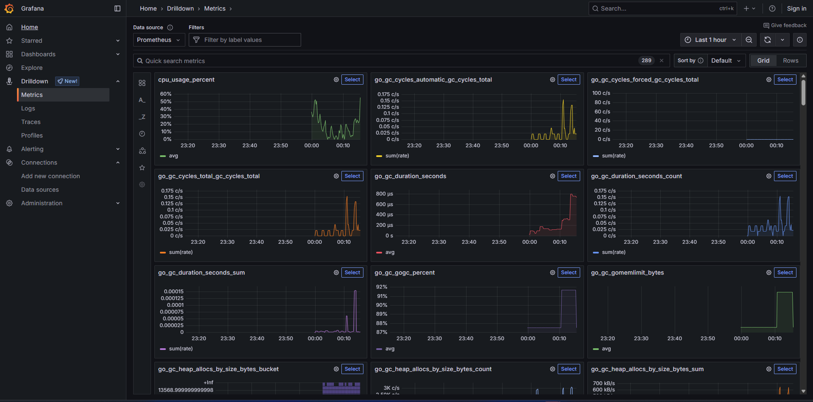

# prom-remote-write


#### Run with dockcer
```sh
$ docker compose ps
NAME                  IMAGE                             COMMAND                  SERVICE               CREATED          STATUS          PORTS
grafana               grafana/grafana:12.0.0            "/run.sh"                grafana               7 minutes ago    Up 40 seconds   0.0.0.0:3000->3000/tcp, [::]:3000->3000/tcp
mock-exporter         prom-remote-write-mock-exporter   "./mock-exporter"        mock-exporter         14 minutes ago   Up 39 seconds   0.0.0.0:2112->2112/tcp, [::]:2112->2112/tcp
prometheus-receiver   prom/prometheus:v3.7.0            "/bin/prometheus --c…"   prometheus-receiver   14 minutes ago   Up 39 seconds   0.0.0.0:9091->9090/tcp, [::]:9091->9090/tcp
prometheus-writer     prom/prometheus:v3.7.0            "/bin/prometheus --c…"   prometheus-writer     14 minutes ago   Up 39 seconds   0.0.0.0:9090->9090/tcp, [::]:9090->9090/tcp
```
#### Test query
```
http_requests_total
cpu_usage_percent
memory_usage_mb
```

#### Check metrics on Grafana

