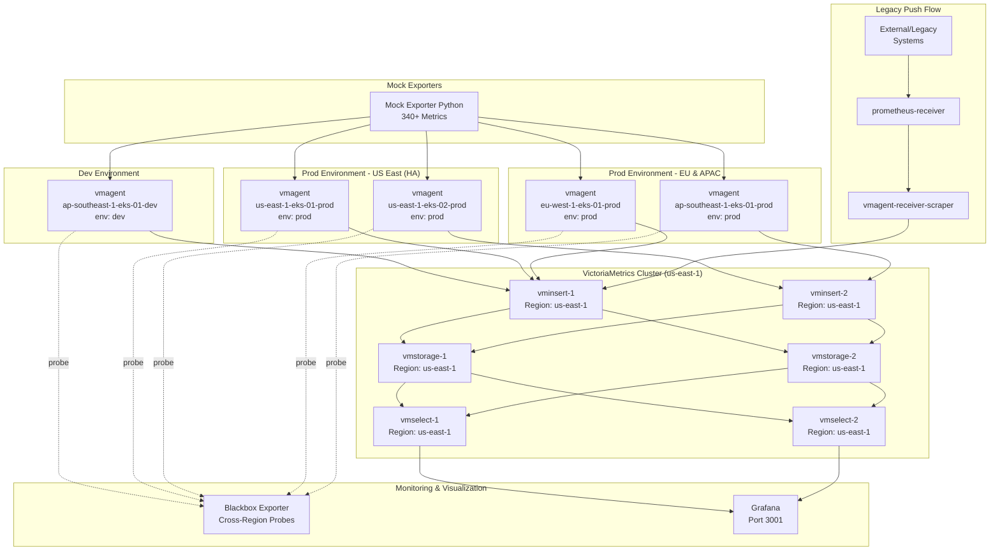

# Monitoring Multi-Environment Multi-Cluster với VictoriaMetrics

Demo kiến trúc observability production-ready với multi-environment (dev/prod), multi-cluster monitoring across regions sử dụng VictoriaMetrics, vmagent, và comprehensive latency monitoring.

## Kiến trúc



## Features

- **Multi-Environment Setup**: Môi trường dev và prod riêng biệt với các cluster chuyên dụng
- **Multi-Cluster HA**: 2 production clusters tại US East cho high availability
- **Multi-Region Monitoring**: 3 AWS regions (us-east-1, eu-west-1, ap-southeast-1)
- **VictoriaMetrics Cluster**: Distributed TSDB với 2x vminsert, 2x vmselect, 2x vmstorage
- **5 vmagent Instances**: Mỗi cluster có vmagent riêng với labels env/region/cluster
- **Legacy System Support**: Prometheus receiver cho remote write từ external systems
- **Cross-Region Latency Monitoring**: Blackbox exporter để monitor network latency
- **Production-Ready Dashboards**: 4 dashboards tập trung (infrastructure, application, monitoring health, cross-region latency)

## Quick Start

```bash
# Clone repository
git clone <repo>
cd prom-remote-writer

# Start all services
docker compose up -d

# Check service status
docker compose ps

# Access Grafana
open http://localhost:3001
# Default credentials: admin/admin
```

## Prerequisites

- Docker Desktop (or Docker Engine + Docker Compose)
- 8GB+ available RAM
- Ports available: 3001, 9091, 9115, 2112, 8429-8434

## Tổng quan Kiến trúc

Dự án demo production-ready multi-environment, multi-cluster monitoring với 2 luồng dữ liệu riêng biệt:

### Flow 1: Scraping (Luồng chính) - Modern vmagent Infrastructure
```
Application/Mock Exporter → vmagent (cùng cluster) → vminsert → vmstorage → vmselect
```

**5 vmagent Clusters**:
- **Dev Environment**: `ap-southeast-1-eks-01-dev`
- **Prod Environment**:
  - `us-east-1-eks-01-prod` (HA cluster 1)
  - `us-east-1-eks-02-prod` (HA cluster 2)
  - `eu-west-1-eks-01-prod`
  - `ap-southeast-1-eks-01-prod`

**Key Features**:
- Mỗi vmagent scrape applications trong cluster của nó
- Self-scraping cho internal metrics (`scrape_duration_seconds`)
- Blackbox exporter probes cho cross-region latency
- `external_labels`: env, region, cluster, availability_zone
- Remote write trực tiếp đến vminsert (không qua intermediary)

### Flow 2: Pushing (Legacy Systems Support)
```
External/Legacy System → prometheus-receiver → vmagent-receiver-scraper → vminsert
```

**Mục đích**: Accept remote write từ external Prometheus instances hoặc legacy systems

**Components**:
- `prometheus-receiver`: Remote write endpoint (port 9091)
- `vmagent-receiver-scraper`: Scrape receiver metrics, forward đến VictoriaMetrics
- Labels: `env=monitoring`, `region=local`, `cluster=monitoring-cluster`

### Flow 3: Query
```
Grafana → vmselect → vmstorage
```

**Data Organization**: Tất cả metrics lưu trong một VictoriaMetrics cluster, phân biệt bằng labels:
- `env`: dev, prod, monitoring
- `region`: us-east-1, eu-west-1, ap-southeast-1, local
- `cluster`: {region}-{env}-{type}-{number}

## Use Cases

### 1. Multi-Environment Monitoring
Monitor riêng biệt dev và prod với isolated metrics:
```promql
# Dev environment metrics
sum(rate(http_requests_total{env="dev"}[5m]))

# Prod environment metrics theo region
sum(rate(http_requests_total{env="prod"}[5m])) by (region)
```

### 2. High Availability Monitoring
US East có 2 clusters cho HA. Monitor độc lập từng cluster:
```promql
# So sánh request rate giữa HA clusters
sum(rate(http_requests_total{cluster=~"us-east-1-prod-eks-.*"}[5m])) by (cluster)
```

### 3. Cross-Region Latency Analysis
Blackbox probes monitor network connectivity và latency:
```promql
# Probe success rate theo source region
avg(probe_success{job="blackbox"}) by (source_region) * 100

# Probe duration
probe_duration_seconds{job="blackbox"}
```

### 4. Legacy System Integration
External Prometheus instances có thể remote write đến prometheus-receiver:
```bash
# External Prometheus config
remote_write:
  - url: http://<your-host>:9091/api/v1/write
```

## Key Components

| Component | Mô tả | Clusters/Instances | Port |
|-----------|-------|-------------------|------|
| **Mock Exporter (Python)** | Generate 340+ Prometheus-compliant metrics | 1 | 2112 |
| **VictoriaMetrics Cluster** | Distributed TSDB | 2x vminsert, 2x vmselect, 2x vmstorage | 8480-8482 |
| **vmagent (Dev)** | Dev environment monitoring | ap-southeast-1-eks-01-dev | 8429 |
| **vmagent (Prod)** | Production monitoring | us-east-1-eks-01-prod/02, eu-west-1-eks-01-prod, ap-southeast-1-eks-01-prod | 8430-8433 |
| **vmagent-receiver-scraper** | Scrape prometheus-receiver | 1 | 8434 |
| **prometheus-receiver** | Remote write endpoint cho legacy systems | 1 | 9091 |
| **blackbox-exporter** | Network probe cho cross-region latency | 1 | 9115 |
| **Grafana** | 4 pre-configured dashboards | 1 | 3001 |

### vmagent Instances

| Container Name | Environment | Region | Cluster | Port |
|----------------|-------------|--------|---------|------|
| vmagent-ap-southeast-1-eks-01-dev | dev | ap-southeast-1 | ap-southeast-1-eks-01-dev | 8429 |
| vmagent-us-east-1-eks-01-prod | prod | us-east-1 | us-east-1-eks-01-prod | 8430 |
| vmagent-us-east-1-eks-02-prod | prod | us-east-1 | us-east-1-eks-02-prod | 8431 |
| vmagent-eu-west-1-eks-01-prod | prod | eu-west-1 | eu-west-1-eks-01-prod | 8432 |
| vmagent-ap-southeast-1-eks-01-prod | prod | ap-southeast-1 | ap-southeast-1-eks-01-prod | 8433 |

## Metrics Generated

**~340+ metrics** across 5 clusters:

### HTTP Service Metrics (RED Method)
- `http_request_duration_seconds` (histogram)
- `http_requests_total` (counter)
- `http_request_size_bytes` (histogram)
- `http_response_size_bytes` (histogram)

### Node/System Metrics (USE Method)
- `node_cpu_seconds_total` (counter)
- `node_memory_MemTotal_bytes` (gauge)
- `node_memory_MemAvailable_bytes` (gauge)
- `node_disk_io_time_seconds_total` (counter)
- `node_network_transmit_bytes_total` (counter)
- `node_network_receive_bytes_total` (counter)
- `node_filesystem_size_bytes` (gauge)
- `node_filesystem_avail_bytes` (gauge)

### Application Business Metrics
- `app_errors_total` (counter)
- `app_database_queries_duration_seconds` (histogram)
- `app_database_connections_active` (gauge)
- `app_cache_requests_total` (counter)
- `app_queue_size` (gauge)
- `app_worker_tasks_duration_seconds` (histogram)
- `app_business_transactions_total` (counter)

### Monitoring Internal Metrics
- `scrape_duration_seconds` (histogram) - vmagent scrape latency
- `vmagent_remotewrite_send_duration_seconds` (histogram) - Remote write latency
- `vmagent_remotewrite_pending_bytes` (gauge) - Pending bytes to send
- `probe_duration_seconds` (gauge) - Blackbox probe latency
- `probe_success` (gauge) - Probe success/failure (0 hoặc 1)

## Grafana Dashboards

Dự án bao gồm 4 production-ready dashboards:

### 1. Global Infrastructure Overview
**Focus**: Cái nhìn tổng quan về toàn bộ hạ tầng monitoring

**Key Panels**:
- Total Metrics Ingestion Rate (samples/sec)
- Ingestion Rate by Region/Environment
- Cluster Status Table (up/down targets)
- Active vmagent Instances Count

**Use Case**: SRE, Manager - Kiểm tra nhanh sức khỏe toàn hệ thống

### 2. Application Performance (RED)
**Focus**: Application-level metrics với filtering theo environment và cluster

**Variables**: `$env` (dev/prod), `$cluster` (dynamic dựa trên env)

**Key Panels**:
- Request Rate by Service/Method
- Current Error Rate (%) Gauge
- Error Rate Over Time by Service
- Request Latency Distribution (Heatmap)
- Latency Percentiles (p50, p95, p99)
- Top 10 Slowest Endpoints

**Use Case**: Developers, Application Owners - Monitor hiệu năng ứng dụng

### 3. Monitoring Stack Health
**Focus**: vmagent, VictoriaMetrics components health

**Variables**: `$cluster` (multi-select, default: All)

**Key Panels**:
- vmagent Remote Write Latency (p90, p95, p99) - QUAN TRỌNG NHẤT
- vmagent Remote Write Pending Bytes
- vmagent Remote Write Success Rate
- Scrape Duration by Cluster
- VictoriaMetrics Components Health Table
- VMStorage Disk Usage
- vminsert/vmselect Request Duration
- VMStorage Slow Inserts Rate

**Use Case**: SRE, Platform Engineers - Đảm bảo monitoring stack healthy

### 4. Cross-Region Latency Monitoring
**Focus**: Network latency và connectivity giữa các regions

**Key Panels**:
- Blackbox Probe Duration by Source Region
- Overall Probe Success Rate (Gauge)
- Total Active Probes Count
- Cross-Region Probe Latency Heatmap
- Top 10 Slowest Probe Paths
- Probe Success Rate by Source Region
- Network Latency Trends (24h)

**Use Case**: Network Engineers, SRE - Monitor cross-region connectivity

## Configuration Best Practices

### vmagent external_labels Strategy

Tất cả vmagents dùng `external_labels` để consistent labeling:

```yaml
# vmagent/us-east-1-eks-01-prod.yml
global:
  scrape_interval: 15s
  external_labels:
    env: "prod"
    region: "us-east-1"
    cluster: "us-east-1-eks-01-prod"
    availability_zone: "us-east-1a"

scrape_configs:
  # Scrape application metrics
  - job_name: "mock-exporter"
    static_configs:
      - targets: ["mock-exporter-python:2112"]
  
  # Self-scrape cho internal metrics (scrape_duration_seconds)
  - job_name: "vmagent"
    static_configs:
      - targets: ["localhost:8429"]
  
  # Blackbox probes cho cross-region latency
  - job_name: "blackbox"
    metrics_path: /probe
    params:
      module: [http_2xx]
    static_configs:
      - targets:
          - http://mock-exporter-python:2112/metrics
    relabel_configs:
      - source_labels: [__address__]
        target_label: __param_target
      - target_label: __address__
        replacement: blackbox-exporter:9115
      - target_label: source_region
        replacement: "us-east-1"
```

**Benefits**:
- Labels tự động applied cho TẤT CẢ scraped metrics
- Single source of truth trong config files
- Dễ maintain và version control
- Query efficiency: filter theo env/region/cluster
- Follows VictoriaMetrics best practices

### Naming Convention

**Cluster naming**: `{region}-{env}-{cluster_type}-{number}`

Ví dụ:
- `us-east-1-eks-01-prod`
- `ap-southeast-1-eks-01-dev`
- `eu-west-1-eks-01-prod`

**Benefits**:
- Phân tách rõ environment (dev/prod)
- Dễ identify region và cluster type (EKS)
- Đánh số tuần tự cho HA clusters trong cùng region

## Query Examples

```promql
# Request rate theo region trong prod
sum by (region) (rate(http_requests_total{env="prod"}[5m]))

# P95 latency so sánh dev vs prod
histogram_quantile(0.95, sum(rate(http_request_duration_seconds_bucket[5m])) by (le, env))

# Multi-cluster comparison trong US East
avg by (cluster) (node_memory_MemAvailable_bytes{region="us-east-1", env="prod"})

# Error rate theo service trong cluster cụ thể
sum by (service) (rate(http_requests_total{env="prod", cluster="us-east-1-eks-01-prod", status_code=~"5.."}[5m])) / 
sum by (service) (rate(http_requests_total{env="prod", cluster="us-east-1-eks-01-prod"}[5m])) * 100

# vmagent remote write latency P95
histogram_quantile(0.95, sum(rate(vmagent_remotewrite_send_duration_seconds_bucket[5m])) by (le, cluster))

# Scrape duration P95 by cluster
histogram_quantile(0.95, sum(rate(scrape_duration_seconds_bucket[5m])) by (le, cluster))

# Blackbox probe success rate
avg(probe_success{job="blackbox"}) by (source_region) * 100

# Cross-region probe latency
probe_duration_seconds{job="blackbox"}
```

## Data Flows Chi Tiết

### Flow 1: Scraping (Main Flow)
1. **Mock Exporter** expose metrics tại `:2112/metrics`
2. **vmagent** trong mỗi cluster:
   - Scrape mock-exporter
   - Scrape self-metrics (`:8429/metrics`)
   - Probe blackbox-exporter
   - Add `external_labels` (env, region, cluster, AZ)
3. **vmagent** remote write đến **vminsert** (load balanced)
4. **vminsert** distribute data đến 2x **vmstorage** nodes
5. **vmselect** query data từ vmstorage
6. **Grafana** query từ vmselect

### Flow 2: Push Flow (Legacy Support)
1. **External/Legacy system** remote write đến **prometheus-receiver** (`:9091/api/v1/write`)
2. **vmagent-receiver-scraper** scrape prometheus-receiver metrics
3. **vmagent-receiver-scraper** remote write đến **vminsert**
4. Data flow giống Flow 1 từ vminsert trở đi

### Load Balancing Strategy
- Dev + Prod Cluster 1 & 3 → `vminsert-1`
- Prod Cluster 2 & 4 → `vminsert-2`
- Receiver scraper → `vminsert-1`

## Ports

- **3001**: Grafana UI
- **9091**: Prometheus Receiver (remote write endpoint)
- **9115**: Blackbox Exporter
- **2112**: Mock Exporter Python
- **8429**: vmagent-ap-southeast-1-eks-01-dev
- **8430**: vmagent-us-east-1-eks-01-prod
- **8431**: vmagent-us-east-1-eks-02-prod
- **8432**: vmagent-eu-west-1-eks-01-prod
- **8433**: vmagent-ap-southeast-1-eks-01-prod
- **8434**: vmagent-receiver-scraper

## Documentation

- [Architecture Guide](docs/architecture/overview.md) - Detailed architecture documentation
- [Federated Multi-Region Architecture](docs/architecture/federated-multi-region.vi.md) - Alternative architecture pattern (Option 2)
- [Metrics Reference](docs/metrics/reference.md) - Comprehensive metrics documentation
- [Quick Start Guide](docs/guides/quick-start.md) - Step-by-step setup instructions
- [Dashboard Guide](docs/guides/dashboard-guide.md) - Guide for each dashboard
- [Latency Monitoring](docs/guides/latency-monitoring.md) - Comprehensive latency monitoring guide
- [Network Latency Simulation](docs/guides/network-latency-simulation.md) - Hướng dẫn simulate network latency

### Alternative Architectures

Dự án này implement **Centralized Single-Region** architecture (VictoriaMetrics cluster ở us-east-1). Để học hỏi, xem [Federated Multi-Region Architecture](docs/architecture/federated-multi-region.vi.md) mô tả pattern thay thế nơi mỗi region có VictoriaMetrics cluster riêng.

**Trade-offs**:
- **Centralized**: Cost thấp hơn, operations đơn giản hơn, nhưng cross-region latency cao hơn
- **Federated**: Latency thấp hơn, compliance tốt hơn, nhưng cost và complexity cao hơn

## License

MIT
