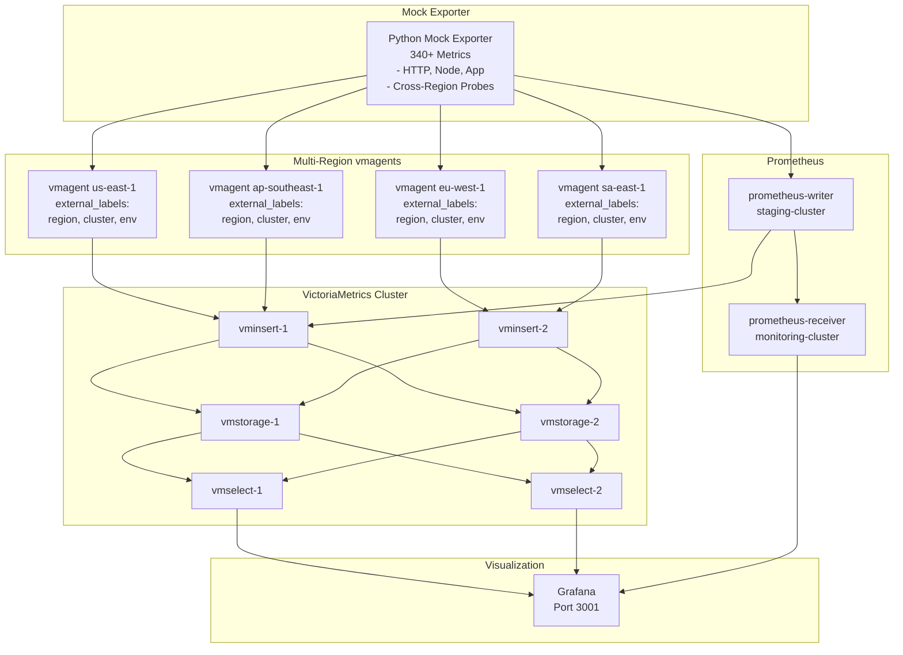

# Prometheus Remote Write Demo với VictoriaMetrics

Demo kiến trúc observability production-ready với Prometheus remote write, VictoriaMetrics cluster, và multi-region simulation.

## Kiến trúc



## Components

- **Mock Exporter (Python)**: 340+ production-like metrics theo chuẩn Prometheus
- **VictoriaMetrics Cluster**: 2 vminsert, 2 vmselect, 2 vmstorage nodes
- **vmagent**: 4 instances cho multi-region simulation (us-east-1, eu-west-1, ap-southeast-1, sa-east-1)
- **Prometheus**: writer + receiver (comparison)
- **Grafana**: 3 main dashboards (Infrastructure, Application, Multi-Region Overview)

## Quick Start

```bash
# Clone và chạy
git clone <repo>
cd prom-remote-write

# Start tất cả services
docker compose up -d

# Check status
docker compose ps

# Access Grafana
open http://localhost:3001
```

## Demo Scenarios

### 1. Prometheus Remote Write
- Prometheus Writer scrape mock-exporter
- Remote write sang Prometheus Receiver
- Query metrics trên Grafana

### 2. VictoriaMetrics Multi-Region
- 4 vmagent instances scrape cùng mock-exporter
- Mỗi vmagent add labels khác nhau (region, cluster, environment) via external_labels
- Tất cả remote write trực tiếp → vminsert cluster
- Query aggregated metrics trên Grafana

### 3. Cross-Region Latency Monitoring
- Synthetic probes giữa các regions (us-east-1, eu-west-1, ap-southeast-1, sa-east-1)
- 16 cross-region connectivity paths được monitor
- Latency tracking với realistic values (30-250ms based on geographical distance)

### 4. Query Comparison
So sánh PromQL queries trên 2 datasources:
- Prometheus Receiver: `http://localhost:9091`
- VictoriaMetrics: `http://localhost:8427/select/0/prometheus`

## Metrics Generated

**~340+ metrics** across 5 regions/environments:

### HTTP Service Metrics (RED Method)
- `http_request_duration_seconds` (histogram)
- `http_requests_total` (counter)
- `http_request_size_bytes` (histogram)
- `http_response_size_bytes` (histogram)

### Node/System Metrics (USE Method)
- `node_cpu_seconds_total` (counter)
- `node_memory_MemTotal_bytes` (gauge)
- `node_memory_MemAvailable_bytes` (gauge)
- `node_disk_io_time_seconds_total` (counter)
- `node_network_transmit_bytes_total` (counter)
- `node_network_receive_bytes_total` (counter)
- `node_filesystem_size_bytes` (gauge)
- `node_filesystem_avail_bytes` (gauge)

### Application Business Metrics
- `app_errors_total` (counter)
- `app_database_queries_duration_seconds` (histogram)
- `app_database_connections_active` (gauge)
- `app_cache_requests_total` (counter)
- `app_queue_size` (gauge)
- `app_worker_tasks_duration_seconds` (histogram)
- `app_business_transactions_total` (counter)

### Cross-Region Probe Metrics (NEW)
- `probe_http_duration_seconds` (histogram) - Latency giữa regions
  - 16 cross-region paths (4 regions × 4 targets)
  - Realistic latencies: 30-250ms based on geographical distance
  - Buckets optimized: [0.01, 0.025, 0.05, 0.1, 0.25, 0.5,  european-latency 1.0, 2.5, 5.0]
- `probe_success_total` (counter) - Probe success/failure rates
  - Tracks connectivity health between regions
  - Success/failure labels để monitor reliability

## Query Examples

```promql
# Request rate by region
sum by (region) (rate(http_requests_total[5m]))

# P95 latency
histogram_quantile(0.95, rate(http_request_duration_seconds_bucket[5m]))

# Multi-region comparison
avg by (region, cluster) (node_memory_MemAvailable_bytes)

# Error rate by service
sum by (service) (rate(http_requests_total{status شخص!~"2.."}[5m])) / 
sum by (service) (rate(http_requests_total[5m])) * 100

# Cross-region latency P50
histogram_quantile(0.50, sum(rate(probe_http_duration_seconds_bucket[5m])) by (le, source_region, target_region))

# Cross-region probe success rate
sum(rate(probe_success_total{result="success"}[5m])) by (source_region, target_region) / 
sum(rate(probe_success_total[5m])) by (source_region, target_region) * 100
```

## vmagent Configuration Best Practices

**Recommended approach - external_labels:**

```yaml
# vmagent/us-east-1.yml
global:
  scrape_interval: 15s
  external_labels:
    region: "us-east-1"
    cluster: "prod-us"
    environment: "production"

scrape_configs:
  - job_name: "mock-exporter-us-east-1"
    static_configs:
      - targets: ["mock-exporter-python:2112"]
    relabel_configs:
      - target_label: job
        replacement: "mock-exporter"
      - target_label: availability_zone
        replacement: "us-east-1a"
```

**Why external_labels?**
- ✅ Labels defined once in config file (single source of truth)
- ✅ Applied to all scraped metrics automatically
- ✅ Easier to maintain and version control
- ✅ Follows VictoriaMetrics best practices
- ✅ No duplicate labels between config and command-line flags

## Key Improvements

**Label Management:**
- Removed duplicate `--remoteWrite.label` flags from docker-compose
- Centralized labels in vmagent config files using `external_labels`
- Consistent labeling across all metrics (region, cluster, environment)

**Multi-Region Observability:**
- Cross-region latency tracking with synthetic probes
- 16 cross-region connectivity paths monitored
- Regional health comparison and performance metrics

**Production-Ready Metrics:**
- Realistic metric values with variations
- Proper Prometheus naming conventions
- Histogram buckets optimized for latency ranges
- Counter increments with realistic rates

## Architecture Details

Xem [docs/architecture/overview.vi.md](docs/architecture/overview.vi.md) cho chi tiết luồng dữ liệu và deployment considerations.

## Metrics Reference

Xem [docs/metrics/reference.vi.md](docs/metrics/reference.vi.md) cho full list metrics và use cases.

## Ports

- **3001**: Grafana
- **9092**: Prometheus Writer
- **9091**: Prometheus Receiver  
- **8427**: VictoriaMetrics vmselect
- **2112**: Mock Exporter Python

## Documentation

For English documentation, see:
- [docs/README.md](docs/README.md) - Documentation index
- [docs/architecture/overview.md](docs/architecture/overview.md) - Architecture overview
- [docs/metrics/reference.md](docs/metrics/reference.md) - Metrics reference
- [docs/guides/](docs/guides/) - User guides

