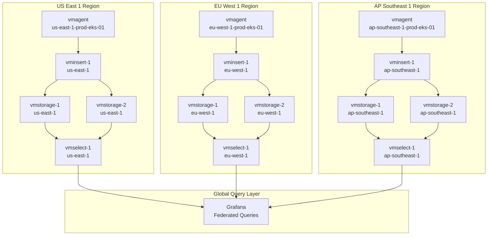

# Federated Multi-Region Architecture (Option 2)

## Overview

This document describes an alternative architecture pattern: **Federated Multi-Region** where each region has its own VictoriaMetrics cluster. This is different from the centralized single-region approach (Option 1) implemented in this project.

## Architecture Diagram



## Key Differences from Centralized Architecture

| Aspect | Centralized (Option 1) | Federated (Option 2) |
|--------|------------------------|----------------------|
| **VM Clusters** | 1 cluster in us-east-1 | 1 cluster per region |
| **Remote Write** | Cross-region (eu-west-1 → us-east-1) | Local (eu-west-1 → eu-west-1) |
| **Latency** | Higher for cross-region writes | Lower (local writes) |
| **Query Complexity** | Simple (single cluster) | Complex (federation needed) |
| **Data Replication** | Within cluster only | Between clusters (optional) |
| **Operational Overhead** | Lower | Higher (multiple clusters) |
| **Cost** | Lower (single cluster) | Higher (multiple clusters) |

## Setup Instructions

### Per-Region Configuration

Each region requires its own VictoriaMetrics cluster:

#### US East 1 Cluster

```yaml
# docker-compose.us-east-1.yml
services:
  vmstorage-us-east-1-1:
    image: victoriametrics/vmstorage:latest
    command:
      - "--storageDataPath=/vmstorage-data"
      - "--retentionPeriod=1y"
  
  vmstorage-us-east-1-2:
    image: victoriametrics/vmstorage:latest
    command:
      - "--storageDataPath=/vmstorage-data"
      - "--retentionPeriod=1y"
  
  vminsert-us-east-1-1:
    image: victoriametrics/vminsert:latest
    command:
      - "--storageNode=vmstorage-us-east-1-1:8400"
      - "--storageNode=vmstorage-us-east-1-2:8400"
  
  vmselect-us-east-1-1:
    image: victoriametrics/vmselect:latest
    command:
      - "--storageNode=vmstorage-us-east-1-1:8401"
      - "--storageNode=vmstorage-us-east-1-2:8401"
```

#### EU West 1 Cluster

Similar structure, but components named `vmstorage-eu-west-1-*`, etc.

### vmagent Configuration

Each vmagent remote writes to its **local** cluster:

```yaml
# vmagent/eu-west-1-prod-eks-01.yml
global:
  external_labels:
    env: "prod"
    region: "eu-west-1"
    storage_region: "eu-west-1"  # Local cluster, not us-east-1
    cluster: "eu-west-1-prod-eks-01"

# Remote write to LOCAL cluster
command:
  - "--remoteWrite.url=http://vminsert-eu-west-1-1:8480/insert/0/prometheus/api/v1/write"
```

## Query Federation

### Option A: Grafana Multi-Datasource

Configure Grafana with multiple datasources (one per region):

```yaml
# grafana/provisioning/datasources/victoriametrics-us-east-1.yml
datasources:
  - name: VictoriaMetrics-US-East-1
    type: prometheus
    url: http://vmselect-us-east-1-1:8481/select/0/prometheus
    jsonData:
      httpMethod: POST

# grafana/provisioning/datasources/victoriametrics-eu-west-1.yml
datasources:
  - name: VictoriaMetrics-EU-West-1
    type: prometheus
    url: http://vmselect-eu-west-1-1:8481/select/0/prometheus
```

**Dashboard Query**:
```promql
# Query all regions
sum(rate(http_requests_total[5m])) by (region)
# Uses Grafana's multi-datasource feature to query all clusters
```

### Option B: VictoriaMetrics Federation

Use vmselect federation to query across clusters:

```yaml
# vmselect-global (federation layer)
vmselect-global:
  image: victoriametrics/vmselect:latest
  command:
    - "--storageNode=vmselect-us-east-1-1:8481"
    - "--storageNode=vmselect-eu-west-1-1:8481"
    - "--storageNode=vmselect-ap-southeast-1-1:8481"
```

**Query Pattern**:
```promql
# Query via federation layer
sum(rate(http_requests_total[5m])) by (region)
# Federation layer aggregates results from all clusters
```

### Option C: PromQL Federation

Use Prometheus federation pattern:

```promql
# In us-east-1 cluster, federate from other clusters
sum(rate(http_requests_total{region="eu-west-1"}[5m])) by (region)
```

## Data Replication Strategies

### Strategy 1: No Replication (Independent Clusters)

Each region's data is independent:
- **Pros**: Lower cost, simpler
- **Cons**: No disaster recovery, can't query across regions easily
- **Use Case**: Regional compliance requirements

### Strategy 2: Cross-Region Replication

Replicate critical metrics to a central cluster:

```yaml
# In eu-west-1 cluster, replicate to us-east-1
vmagent-replicator:
  command:
    - "--remoteWrite.url=http://vminsert-us-east-1-1:8480/insert/0/prometheus/api/v1/write"
    - "--remoteWrite.url=http://vminsert-eu-west-1-1:8480/insert/0/prometheus/api/v1/write"  # Local
```

### Strategy 3: Selective Replication

Only replicate specific metrics (e.g., SLO metrics):

```yaml
# Replicate only SLO metrics
remote_write:
  - url: http://vminsert-us-east-1-1:8480/insert/0/prometheus/api/v1/write
    write_relabel_configs:
      - source_labels: [__name__]
        regex: 'slo_.*|error_rate|latency_p95'
        action: keep
```

## Pros and Cons

### Pros of Federated Architecture

1. **Lower Latency**: Local remote writes (no cross-region network)
2. **Regional Compliance**: Data stays in region (GDPR, data sovereignty)
3. **Fault Isolation**: Region failure doesn't affect others
4. **Scalability**: Each region scales independently
5. **Network Efficiency**: Less cross-region bandwidth usage

### Cons of Federated Architecture

1. **Operational Complexity**: Multiple clusters to manage
2. **Higher Cost**: More infrastructure (3x clusters)
3. **Query Complexity**: Federation needed for global queries
4. **Data Consistency**: Harder to ensure consistency across regions
5. **Replication Overhead**: If replication is needed

## When to Choose Federated vs Centralized

### Choose Federated When:

- **Compliance Requirements**: Data must stay in specific regions (GDPR, etc.)
- **Low Latency Critical**: Remote write latency must be < 50ms
- **High Regional Traffic**: Each region generates > 1M samples/sec
- **Fault Isolation**: Need complete isolation between regions
- **Multi-Tenant**: Different customers in different regions

### Choose Centralized When:

- **Cost Sensitive**: Want to minimize infrastructure cost
- **Simpler Operations**: Prefer single cluster to manage
- **Global Queries**: Need to query across all regions frequently
- **Small Scale**: < 500K samples/sec per region
- **Learning/Development**: Easier to understand and debug

## Latency Comparison

### Centralized Architecture

```
eu-west-1 vmagent → us-east-1 vminsert
Latency: ~150ms (cross-region)
```

### Federated Architecture

```
eu-west-1 vmagent → eu-west-1 vminsert
Latency: ~5ms (local)
```

**Impact**: Federated reduces remote write latency by 30x for cross-region vmagents.

## Migration Path

If starting with centralized and need to migrate to federated:

1. **Phase 1**: Deploy new clusters in each region
2. **Phase 2**: Update vmagents to dual-write (old + new cluster)
3. **Phase 3**: Update Grafana to query new clusters
4. **Phase 4**: Stop writing to centralized cluster
5. **Phase 5**: Decommission centralized cluster

## Example Configuration

### Complete Federated Setup

```yaml
# docker-compose.federated.yml
services:
  # US East 1 Cluster
  vmstorage-us-east-1-1:
    image: victoriametrics/vmstorage:latest
    command:
      - "--storageDataPath=/vmstorage-data"
    volumes:
      - vmstorage-us-east-1-1-data:/vmstorage-data
  
  vminsert-us-east-1-1:
    image: victoriametrics/vminsert:latest
    command:
      - "--storageNode=vmstorage-us-east-1-1:8400"
      - "--storageNode=vmstorage-us-east-1-2:8400"
  
  # EU West 1 Cluster
  vmstorage-eu-west-1-1:
    image: victoriametrics/vmstorage:latest
    command:
      - "--storageDataPath=/vmstorage-data"
    volumes:
      - vmstorage-eu-west-1-1-data:/vmstorage-data
  
  vminsert-eu-west-1-1:
    image: victoriametrics/vminsert:latest
    command:
      - "--storageNode=vmstorage-eu-west-1-1:8400"
      - "--storageNode=vmstorage-eu-west-1-2:8400"
  
  # Federation Layer
  vmselect-global:
    image: victoriametrics/vmselect:latest
    command:
      - "--storageNode=vmselect-us-east-1-1:8481"
      - "--storageNode=vmselect-eu-west-1-1:8481"
      - "--storageNode=vmselect-ap-southeast-1-1:8481"
```

### vmagent Configuration

```yaml
# vmagent/eu-west-1-prod-eks-01.yml
global:
  external_labels:
    env: "prod"
    region: "eu-west-1"
    storage_region: "eu-west-1"  # Local cluster
    cluster: "eu-west-1-prod-eks-01"

# Remote write to LOCAL cluster
command:
  - "--remoteWrite.url=http://vminsert-eu-west-1-1:8480/insert/0/prometheus/api/v1/write"
```

## Query Examples

### Global Query (All Regions)

```promql
# Via federation layer
sum(rate(http_requests_total[5m])) by (region)

# Via Grafana multi-datasource
# Query: $datasource = All
sum(rate(http_requests_total[5m])) by (region)
```

### Regional Query (Single Region)

```promql
# Direct query to regional cluster
sum(rate(http_requests_total{region="eu-west-1"}[5m]))
```

### Cross-Region Comparison

```promql
# Compare request rate across regions
sum(rate(http_requests_total[5m])) by (region, storage_region)
```

## Monitoring the Federation

### Key Metrics

```promql
# Federation query latency
histogram_quantile(0.95, sum(rate(vm_http_request_duration_seconds_bucket{job="vmselect-global"}[5m])) by (le))

# Regional cluster health
up{job="vmselect"} by (region)

# Data freshness per region
time() - max(timestamp(up{job="vmselect"})) by (region)
```

## Cost Analysis

### Centralized (Option 1)

- **VM Clusters**: 1 cluster (6 nodes)
- **Estimated Cost**: $X/month
- **Cross-Region Bandwidth**: High (all remote writes)

### Federated (Option 2)

- **VM Clusters**: 3 clusters (18 nodes total)
- **Estimated Cost**: ~3x centralized
- **Cross-Region Bandwidth**: Low (only federation queries)

## Conclusion

Federated multi-region architecture provides:
- Lower latency for regional vmagents
- Better compliance posture
- Regional fault isolation
- But at the cost of operational complexity and infrastructure cost

Choose based on your specific requirements: compliance, latency, cost, and operational capabilities.

## References

- [VictoriaMetrics Federation](https://docs.victoriametrics.com/Cluster-VictoriaMetrics.html#federation)
- [Prometheus Federation](https://prometheus.io/docs/prometheus/latest/federation/)
- [Multi-Region Architecture Patterns](https://aws.amazon.com/architecture/multi-region/)

