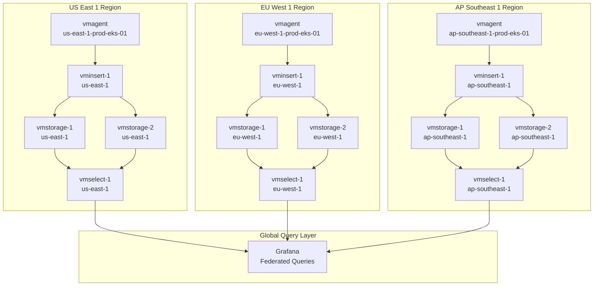

# Kiến Trúc Federated Multi-Region (Option 2)

## Tổng quan

Tài liệu này mô tả một kiến trúc thay thế: **Federated Multi-Region** nơi mỗi region có VictoriaMetrics cluster riêng. Đây khác với centralized single-region approach (Option 1) đang được implement trong project này.

## Kiến Trúc



## So Sánh với Centralized Architecture

| Khía cạnh | Centralized (Option 1) | Federated (Option 2) |
|-----------|------------------------|----------------------|
| **VM Clusters** | 1 cluster ở us-east-1 | 1 cluster mỗi region |
| **Remote Write** | Cross-region (eu-west-1 → us-east-1) | Local (eu-west-1 → eu-west-1) |
| **Latency** | Cao hơn cho cross-region writes | Thấp hơn (local writes) |
| **Query Complexity** | Đơn giản (single cluster) | Phức tạp (cần federation) |
| **Data Replication** | Chỉ trong cluster | Giữa các clusters (optional) |
| **Operational Overhead** | Thấp hơn | Cao hơn (nhiều clusters) |
| **Cost** | Thấp hơn (single cluster) | Cao hơn (nhiều clusters) |

## Hướng Dẫn Setup

### Cấu Hình Mỗi Region

Mỗi region cần VictoriaMetrics cluster riêng:

#### US East 1 Cluster

```yaml
# docker-compose.us-east-1.yml
services:
  vmstorage-us-east-1-1:
    image: victoriametrics/vmstorage:latest
    command:
      - "--storageDataPath=/vmstorage-data"
      - "--retentionPeriod=1y"
  
  vminsert-us-east-1-1:
    image: victoriametrics/vminsert:latest
    command:
      - "--storageNode=vmstorage-us-east-1-1:8400"
      - "--storageNode=vmstorage-us-east-1-2:8400"
```

### Cấu Hình vmagent

Mỗi vmagent remote write đến cluster **local** của nó:

```yaml
# vmagent/eu-west-1-prod-eks-01.yml
global:
  external_labels:
    env: "prod"
    region: "eu-west-1"
    storage_region: "eu-west-1"  # Local cluster, không phải us-east-1
    cluster: "eu-west-1-prod-eks-01"

# Remote write đến LOCAL cluster
command:
  - "--remoteWrite.url=http://vminsert-eu-west-1-1:8480/insert/0/prometheus/api/v1/write"
```

## Query Federation

### Option A: Grafana Multi-Datasource

Cấu hình Grafana với nhiều datasources (mỗi region một datasource):

```yaml
# grafana/provisioning/datasources/victoriametrics-us-east-1.yml
datasources:
  - name: VictoriaMetrics-US-East-1
    type: prometheus
    url: http://vmselect-us-east-1-1:8481/select/0/prometheus

# grafana/provisioning/datasources/victoriametrics-eu-west-1.yml
datasources:
  - name: VictoriaMetrics-EU-West-1
    type: prometheus
    url: http://vmselect-eu-west-1-1:8481/select/0/prometheus
```

**Dashboard Query**:
```promql
# Query tất cả regions
sum(rate(http_requests_total[5m])) by (region)
# Sử dụng Grafana multi-datasource feature để query tất cả clusters
```

### Option B: VictoriaMetrics Federation

Sử dụng vmselect federation để query across clusters:

```yaml
# vmselect-global (federation layer)
vmselect-global:
  image: victoriametrics/vmselect:latest
  command:
    - "--storageNode=vmselect-us-east-1-1:8481"
    - "--storageNode=vmselect-eu-west-1-1:8481"
    - "--storageNode=vmselect-ap-southeast-1-1:8481"
```

## Ưu và Nhược Điểm

### Ưu Điểm của Federated Architecture

1. **Latency Thấp Hơn**: Local remote writes (không có cross-region network)
2. **Regional Compliance**: Data ở lại trong region (GDPR, data sovereignty)
3. **Fault Isolation**: Region failure không ảnh hưởng regions khác
4. **Scalability**: Mỗi region scale độc lập
5. **Network Efficiency**: Ít cross-region bandwidth usage

### Nhược Điểm của Federated Architecture

1. **Operational Complexity**: Nhiều clusters để quản lý
2. **Cost Cao Hơn**: Nhiều infrastructure hơn (3x clusters)
3. **Query Complexity**: Cần federation cho global queries
4. **Data Consistency**: Khó đảm bảo consistency across regions
5. **Replication Overhead**: Nếu cần replication

## Khi Nào Chọn Federated vs Centralized

### Chọn Federated Khi:

- **Compliance Requirements**: Data phải ở lại trong specific regions (GDPR, etc.)
- **Low Latency Critical**: Remote write latency phải < 50ms
- **High Regional Traffic**: Mỗi region generate > 1M samples/sec
- **Fault Isolation**: Cần complete isolation giữa regions
- **Multi-Tenant**: Different customers ở different regions

### Chọn Centralized Khi:

- **Cost Sensitive**: Muốn minimize infrastructure cost
- **Simpler Operations**: Prefer single cluster để quản lý
- **Global Queries**: Cần query across tất cả regions thường xuyên
- **Small Scale**: < 500K samples/sec per region
- **Learning/Development**: Dễ hiểu và debug hơn

## So Sánh Latency

### Centralized Architecture

```
eu-west-1 vmagent → us-east-1 vminsert
Latency: ~150ms (cross-region)
```

### Federated Architecture

```
eu-west-1 vmagent → eu-west-1 vminsert
Latency: ~5ms (local)
```

**Impact**: Federated giảm remote write latency 30x cho cross-region vmagents.

## Migration Path

Nếu bắt đầu với centralized và cần migrate sang federated:

1. **Phase 1**: Deploy new clusters trong mỗi region
2. **Phase 2**: Update vmagents để dual-write (old + new cluster)
3. **Phase 3**: Update Grafana để query new clusters
4. **Phase 4**: Stop writing đến centralized cluster
5. **Phase 5**: Decommission centralized cluster

## Query Examples

### Global Query (Tất Cả Regions)

```promql
# Via federation layer
sum(rate(http_requests_total[5m])) by (region)

# Via Grafana multi-datasource
# Query: $datasource = All
sum(rate(http_requests_total[5m])) by (region)
```

### Regional Query (Single Region)

```promql
# Direct query đến regional cluster
sum(rate(http_requests_total{region="eu-west-1"}[5m]))
```

## Kết Luận

Federated multi-region architecture cung cấp:
- Latency thấp hơn cho regional vmagents
- Better compliance posture
- Regional fault isolation
- Nhưng với cost là operational complexity và infrastructure cost cao hơn

Chọn dựa trên requirements cụ thể: compliance, latency, cost, và operational capabilities.

